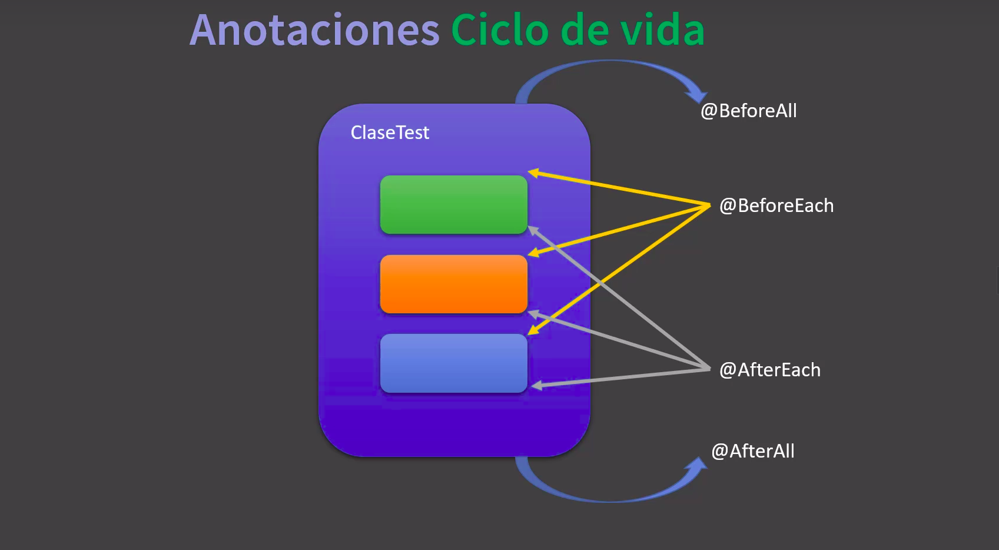

## Atajos teclado

* ctrl + shif + F10: sobre la prueba unitaria, ejecuta solo dicha prueba
* ctrl + / : comenta | decomenta el código
* ctrl + tab: navega entre las diferentes ventanas
* alt + 1: oculta barra de tareas

## TDD 

> Test Driven Development

## @Pruebas condicionales

* las concidionales, son pruebas unitarias que se van a ejecutar en cierto escenario, no siempre
* por ejemplo correr una prueba unitaria esta en linux
* ejecutar ciertas pruebas unitarias segun la version de java 1.8 o 11
* lo mismo para ejecutar ciertas pruebas con diferentes ambientes, desarrollo, test, produccion
* 

